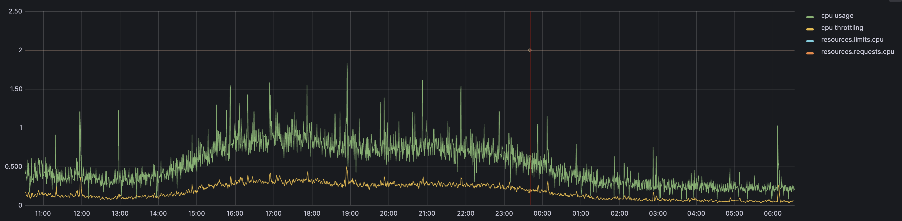

# 🏃‍♂️ 1st day and km: CPU Throttling Mystery

“Wait… my Pod has both CPU requests and limits set to 2.0. It’s not even maxing out usage, but I still see throttling?!”



Yes, it happens. Yes, it’s frustrating.
Yes, there’s an explanation. 👇

Even the service is not hitting Pod CPU limits, it is being CPU throttled. This behaviour is quite strange and should be investigated more in depth - because it limits our ability to control the service correctly for resource constraints.

## Root cause
Checking the [K8s docs](https://kubernetes.io/docs/concepts/configuration/manage-resources-containers/#how-pods-with-resource-limits-are-run):

```
The CPU limit defines a hard ceiling on how much CPU time the container can use. During each scheduling interval (time slice), the Linux kernel checks to see if this limit is exceeded; if so, the kernel waits before allowing that cgroup to resume execution.
```

So we can assume that the workload has very short bursts of CPU that cause the throttling, but in general are so short, that can't be seen on the averaged CPU service graph in Grafana.

After some investigation - the `time slice` is hard-coded in Kubernetes for now for 100ms. So the throttling can happen in one 100ms interval and not on others.

The underlying issue was in fact that for some Java Spring application a configuration mistake was made. Instead of pushing some batches for processing to a thread pool with some small number of threads, thread pool was created with a capacity of 500 threads. So some batch of work was takes and in 100ms exceeded CPU limits 2.0 cpu, thus throttling started. However the work was done shortly, so in averaging dashboard the CPU is correctly shown as not fully utilized for the whole period of time.

[Back](../)