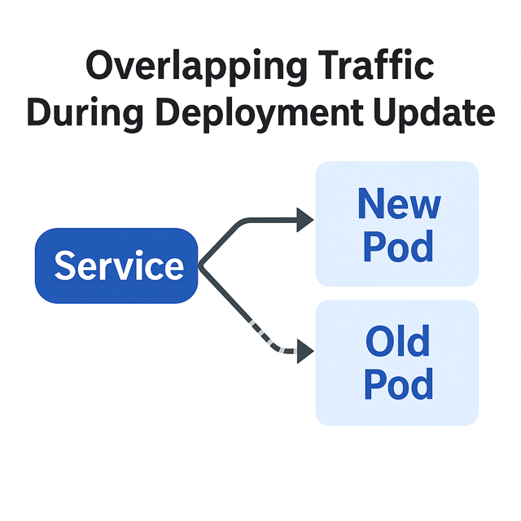

# 🏃‍♂️ 2nd day and km: When does networking _really_ switch over after a Deployment update?

So I’ve rolled out a new image of my service — changed YAML, rollout went fine.
But... the old Pod kept receiving traffic for up to ~15 seconds after the update.
That’s a big problem for me.

For a (typically brief) period of time, this is in fact happening:

## Why?
My service must run in exactly 1 replica — no overlap. It relies heavily on:

* 🧠 in-memory caching
* 🔢 global sequences
* 🧵 no concurrency from other Pods

Even a short overlap breaks things in subtle, messy ways.

## Root cause

I see this a lot, because typically ops and devs coming from an imperative world just fire a command and it's done. Fire and forget.

Kubernetes is event-driven, eventually-consistent system. When you think about it - kube-apiserver is in fact just a smarter database with some failsafes and automation on top of etcd (which is a database itself). It just keeps the correct state, it not executing anything, but leaves the controllers, DaemonSets and many applications check the state and watch for changes, so they can react (almost) instantly. If the application of change fails, there is a reconciliation loop and it retries again and again.

In our example (with a lot simplifications not mentioning Endpoints, EndpointSlices etc) a Service manages Ready Pod list behind the scenes. Also kube-proxy is responsible to route request correct *from the caller node* (iptables or IPVS tricks). So in order to change the Ready Pod list, all nodes needs to receive an update for their instance of kube-proxy. And this by definition can't happen at the single point in time, so there are some delays. The situation is even more interesting, if you are using a LoadBalancer from your favourite cloud provider - so you can imagine again that it takes some time to reconfigure it.

You would typically see < 5s reactions in the happy path. But now imagine a networking packet is lost, so retransmit with a timeout needs to happen. Node is restarting, kube-apiproxy Pod is restarting. And in some worst-cases you can have even a network failure, so some nodes don't see others and don't get updates. In such cases, for some time, two nodes might route the traffic to a different Pod altogether thinking they they are right (because one of the nodes didn't receive any update to change). This scenario is typically called `split-brain`, is hard to detect and you can't protect 100%. There is a good discussion happening about different layers of the problem for example when running a [PostgreSQL database via CloudNativePG](https://github.com/cloudnative-pg/cloudnative-pg/issues/7407).

The take-away here is that situation will happen and you need just to think about if you are resilitient. I think that it is so surprising typically for ops and devs becase when you start a new Pod, everyone understand it needs to boot. But when you change a networking-like configuration, it's just instant iptables command, right? No.

So practically, you have 2 options:
* either can't start a new Pod in parallel (so the old version is stopped before the new version started) - so you'll see downtime. Check [Deployment.spec.strategy](https://kubernetes.io/docs/concepts/workloads/controllers/deployment/#strategy)
* or you need to make your Pods (with possibly different versions at the same time) work in parallel

_Note: You can check native Kubernetes mechanism called [Leases](https://kubernetes.io/docs/concepts/architecture/leases/) which serve as a kind of a lock guaranteeing that only on Pod at a time can hold it._

[Back](../)