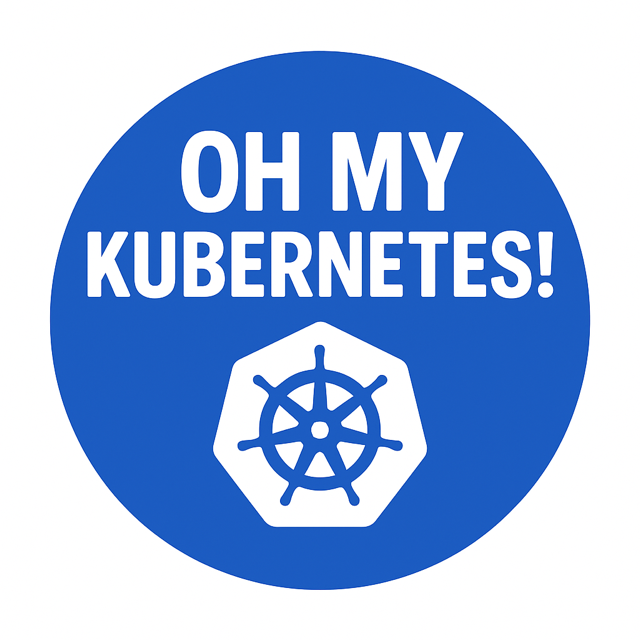

# 🏃‍♂️ 3rd day and km: 100% Node Efficiency — But at What Cost?

🔥 100% Node Efficiency — But at What Cost?

You’ve optimized your cluster beautifully.
Pods are humming. Nodes are maxed out — perfect efficiency.

Then business hours hit.
Traffic spikes.
🚨 Autoscaler kicks in... but you wait. Oh My Kubernetes, what can I do to make it faster?

## Why?
Because Kubernetes has to spin up a new node.
On some clouds (hello, Oracle OKE 👋), that can take up to 10 minutes by default. Even if you optimize it to ~2 mins, it’s still painfully slow when you're under pressure.

And those Pods?
Just sitting in `Pending`.

## Root cause

🧠 “Is there any way to avoid waiting for a new node?”
Yes… but it’s not obvious. Because typically with auto-scaling, Kubernetes allocates minimum number of nodes to satisfy the Pods for scheduling. Of course there in a real cluster there is always some churn, so 100% efficiency is very unlikely. However imagine a scenario running on 90% capacity and not having enough space to deploy your critical bulky microservice.

The possible solution here is to create "dummy" Pod (or Pods) with the cpu+mem specification of your real workload but with lower priority. 

```
apiVersion: scheduling.k8s.io/v1
kind: PriorityClass
metadata:
  name: lower-priority
value: -1
globalDefault: false
description: "This priority is used, so that a dummy Pods gets evicted once the real workload is scheduled."
---
apiVersion: apps/v1
kind: Deployment
metadata:
  name: dummy-pod
  labels:
    app: overprovisioning
spec:
  replicas: 1
  selector:
    matchLabels:
      app: overprovisioning
  template:
    metadata:
      labels:
        app: overprovisioning
    spec:
      containers:
      - name: pause
        image: registry.k8s.io/pause
        resources:
          requests:
            cpu: "1"
            memory: "500Mi"
          limits:
            cpu: "1"
            memory: "500Mi"
      priorityClassName: lower-priority
```

So what will happen - if there is not enough space to schedule a regular workload (any Pod, because by default the priority is `0`), `dummy-pod` will be terminated. Real workload will be scheduled (reusing the original resources). At this point `dummy-pod` will be scheduled again, and this might mean that another node needs to be started, if there is not enough capacity.

So you are not doing any magic here, just "pre-provisioning" node or nodes to be able to very quickly react with Pod autoscaling. Of course the reaction is limited with how many nodes you have pre-provisioned.

If you are interested more in scaling, checkout my [session from TechMeetup](https://medium.com/@davidpech_39825/serverless-kubernetes-wasm-vs-knative-vs-regular-autoscaling-bfed679fec27).



[Back](../)