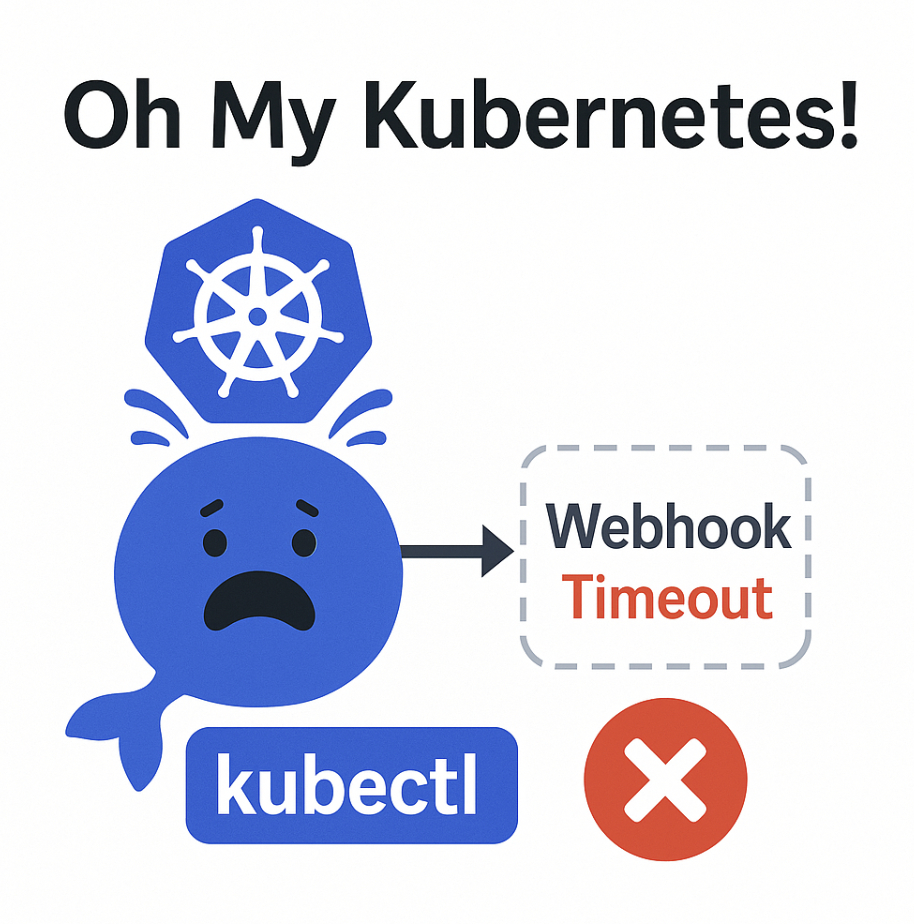

# 🏃‍♂️ 4th day and km: Cluster Frozen. Webhook Woes.

I just installed a shiny new security/policy tool in my Kubernetes cluster.
Everything seemed fine… until everything broke.

* I can list Pods and other resources 🟢
* I can see their status/describe 🟢
* But I can’t make a single change 🔴

Every kubectl apply, delete, scale — all fail with a webhook timeout.
It’s like the cluster is pretending to be alive, but any mutation is silently intercepted by a failing admission webhook.

And of course, the managed service provider says: “All green from our side”.
Not helpful.

## Why?

A failing admission webhook with `failurePolicy: Fail` = a bricked cluster.

It doesn’t even need to crash — just timeout is enough to make your whole control plane unresponsive to changes. It of course much depends on the (admission webhooks configuration)[https://kubernetes.io/docs/reference/access-authn-authz/extensible-admission-controllers/#timeouts], but for example `Kyverno` in some configurations inspect ALL resource changes.

## Root cause

So you have multiple options, either:
* remove problematic `MutatingAdmissionWebhook` or `ValidatingAdmissionWebhook` - the one that is using the problematic webhook
  * of course you might be dropping the security that the tool provides
  * or you can change `failurePolicy` a timeout, or the narrow the definition - so the webhook Pods can start and become ready.
* make webhook work, I've seen multiple problems here
  * webhook Pods are not ready for some reason - inspecting logs typically help. It varies, for example I've seen a problem that the Pod could not became ready because it couldn't acquire `Lease`. But the `Lease` creation was declined because of the webhook...
  * webhook Pods are not being even scheduled - becase it's trying to call the same webhook - removing admission webhook configuration will help here
  * kube-apiserver is throwing TLS error communicating with a webhook - typically this means some messed up installation. In some cases restarting Pods work (for example because they reread Secret that kube-apiserver is using)

It might get even much more complicated, because for example Kyverno is constantly trying to recreate the admission webhook configuration - so you drop it and it's back again in no time.

Would you like to try this situation yourself? I've create a (simulator for this problem on Killercoda)[https://killercoda.com/davidpechcz/scenario/admission-webhooks].

[Back](../)