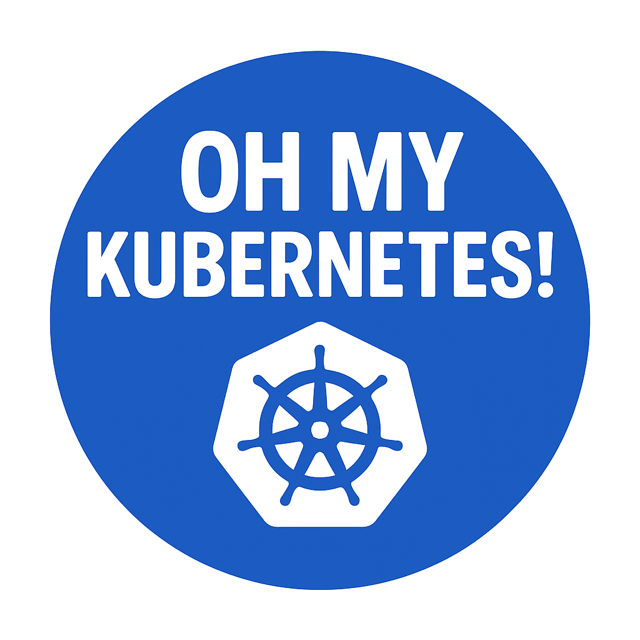

# 🏃‍♂️ 5th day and km: From VM to Kubernetes — What Could Go Wrong with Networking?

You're migrating a microservice from a classic VM setup to Kubernetes.
Same app, same port, similar config.
It was running just fine behind a reverse proxy (nginx, Apache) before.
Easy, right?

* ✅ Probes are green
* ✅ Pod is running
* ✅ Service is up
* ❌ But you get: Connection refused when trying to reach the Service from other Pods

Wait… what? Oh My Kubernetes!
You even `kubectl exec` into the Pod, do a `curl localhost`, and that works.

🕵️‍♂️ Welcome to the "Kubernetes Networking Mystery."

## Why?

You need to remember that each Pod has (typically) a separate networkng namespace - meaning it has 2 interfaces - loopback (localhost) and eth0.

It’s one of those cases where everything looks good, but something subtle (like the container binding port only on `localhost`) breaks external access.

💡 Lessons:

* Localhost in the Pod ≠ accessible from the outside
* Reverse proxy behavior might not map 1:1
* Even probes might not catch wrong listen addresses

## Root cause

Your application is not binding port to 0.0.0.0 (all interfaces). Fix the configuration and you are good to go.

[Back](../)